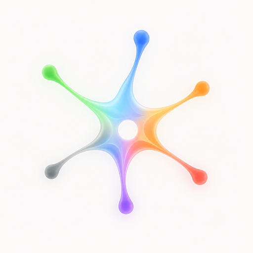

# nerve (job status plugin)

<p align="center">
  
</p>

Reports agent session lifecycle to the **Nerve** menu-bar hub as **jobs**.

- Fail-open: if Nerve is down, hooks exit `0` and never block the agent.
- **No environment variables.** Ingest URL is fixed: `http://127.0.0.1:17890`.
- **Stateless:** no `~/.nerve` state files; each event posts a full job snapshot.
- **Alias** = free-form machine label (prefer Bonjour LocalHostName on macOS). Nerve shows whatever arrives; Settings → Machines is only for SSH tunnels.

## Install from GitHub

### Claude Code

```text
/plugin marketplace add Roy-Kid/nerve
/plugin install nerve@nerve
```

### Codex CLI

```bash
codex plugin marketplace add Roy-Kid/nerve
codex plugin add nerve@nerve
```

## Remote machines

On the **Mac running Nerve**:

1. Settings → **Machines** → **Add Machine…**
2. Alias = remote hostname short name
3. Host / user / optional identity file
4. Enable + Connect (SSH reverse tunnel managed by Nerve)

On the remote, install this plugin and run sessions as usual — hooks post to `127.0.0.1:17890`, which the tunnel forwards to the host.

## What it reports

**One job per conversation** (`{producer}:{session_id}`). Subagents are not separate panel rows — they only refine the main session’s `current` facet.

| Hook (structured) | Main session facets | Ribbon |
|-------------------|---------------------|--------|
| `SessionStart` | `active` + `starting` | Running |
| `UserPromptSubmit` | `active` + `thinking` | Running |
| `PreToolUse` / `PostToolUse` (main thread) | `active` + `tool` / `subagent` | Running |
| `SubagentStart` | `active` + `current.type=subagent` | Running |
| `SubagentStop` (no other bg work) | `active` + `thinking` | Running |
| `Stop` + non-empty `background_tasks` | `current.type=subagent` | Running |
| `Stop` empty bg / `idle_prompt` | `attention.reason=input` | Attention |
| `PermissionRequest` / `permission_prompt` | `attention.reason=approval` | Attention |
| `SessionEnd` | `ended` + success | **Leaves panel** |
| Other `Notification` (no type) | `active` + `info` | Running |

**Noise control:** hooks that fire *inside* a subagent (`agent_id` set) for `PreToolUse` / `PostToolUse` / `UserPromptSubmit` are **ignored**. SubagentStart/Stop brackets and Permission still update the main row.

Status is **never** inferred from free-text titles/messages — only event name + structured fields (`notification_type`, `background_tasks`, …).

Job ids: `claude-code:…`, `codex:…`, `grok:…`.

## Development

```bash
python3 sources/agents/tests/test_nerve_hook.py
```
